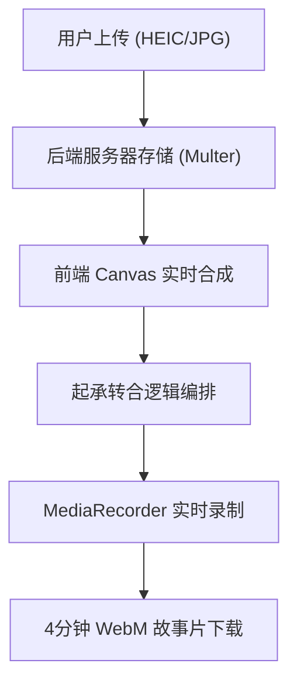
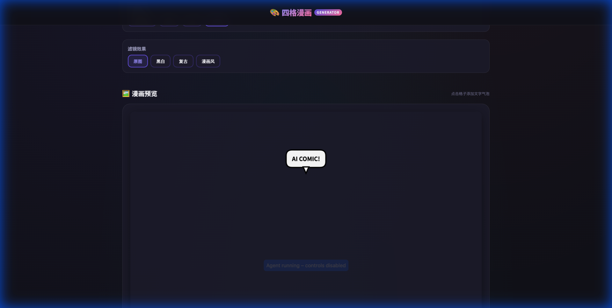
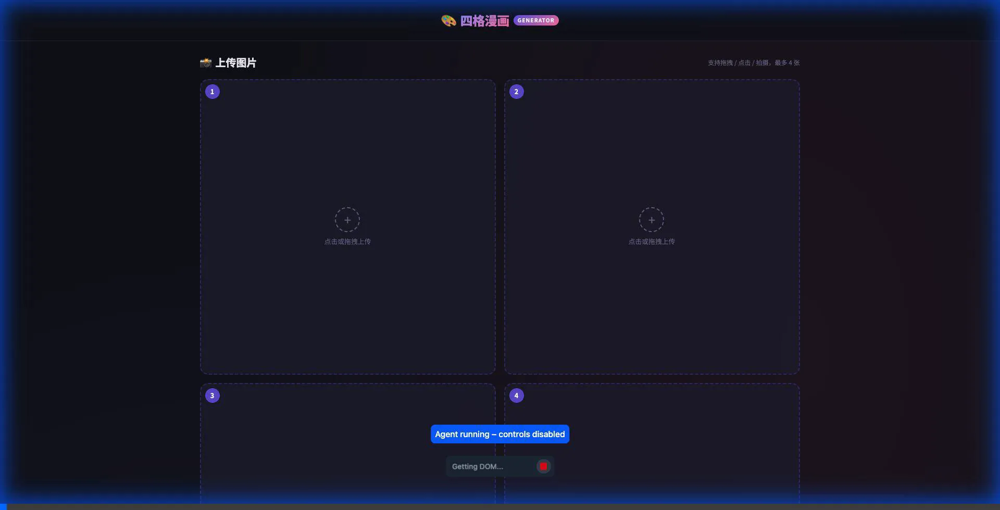

---

## 🛠️ 技术实现架构 (Technical Stack)

| 模块 | 技术实现 | 关键价值 |
| :--- | :--- | :--- |
| **容器层** | Node.js + Express | 稳定的后端支撑与资源托管 |
| **存储层** | Multer 磁盘存储 | 解决前端刷新丢失图片的问题（持久化） |
| **渲染层** | Canvas 2D API | 像素级精准控制“起承转合”的每一帧 |
| **动画层** | Ken Burns 算法 | 赋予静态漫画电影感的镜头语言 |
| **通讯层** | Vite Proxy + CORS | 前后端无缝联动，开发体验极佳 |

---

## 🚀 核心流程回顾


---

## 🖼️ 演示与成果展

我已通过自动化测试工具验证了全流程，以下是生成的漫画预览及操作录屏：

````carousel

<!-- slide -->

````

---

## 📄 产品理念

更多关于 **“4格”** (起承转合) 的设计理念与未来规划，请查看：
- [“4格” 产品策划文档](./PRODUCT.md)

---

## 🔗 代码仓库 (Source Code)

项目代码已成功同步至 GitHub：
- [Johnny2014/comic-generator](https://github.com/Johnny2014/comic-generator)

---

## ✅ 交付状态清单

- [x] **四格漫画核心**: 布局选择、边框切换、滤镜应用。
- [x] **文字系统**: 交互式气泡添加，支持多种气泡类型。
- [x] **视频生成**: 1分钟/格的 Ken Burns 动画导出。
- [x] **Node.js 后端**: 实现图片上传持久化与代理配置。
- [x] **移动端适配**: 全响应式 UI 体验。
- [x] **产品文档**: 完成“4格”产品理念与叙事架构文档。
